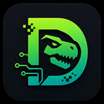

# Dillrex



Dillrex is a small Python-powered programming language experiment.

The first version supports:

- `print("hello")`
- `name = in("Name: ")`
- `if condition { ... } else { ... }`
- `loop condition { ... }`
- `fn main() { ... }`
- `# comments`

## Example

```dillrex
# My first Dillrex program

fn main() {
    name = in("Name: ")

    if name == "Dylan" {
        print("Welcome back Dylan")
    } else {
        print("Hello " + name)
    }

    x = 0
    loop x < 5 {
        print(x)
        x = x + 1
    }
}
```

## Run

```powershell
python -m dillrex run examples\hello.drx
```

On Linux:

```bash
python3 -m dillrex run examples/hello.drx
```

## Open The Dillrex Terminal

```powershell
python -m dillrex shell
```

On Linux:

```bash
python3 -m dillrex shell
```

The terminal icon lives at `assets/dillrex-icon.png`, with a Windows `.ico` version at
`assets/dillrex-icon.ico`.

## Tests

```bash
python -m unittest tests.test_dillrex
```
